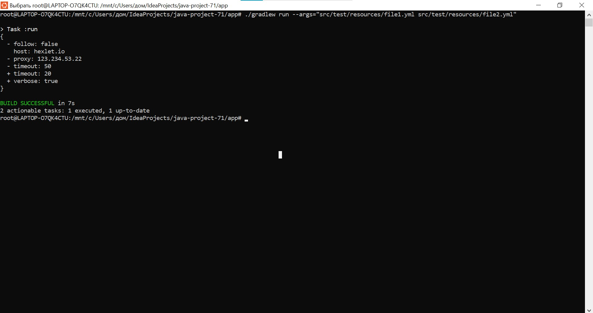
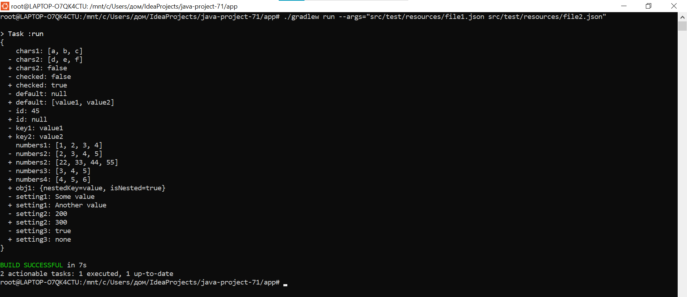
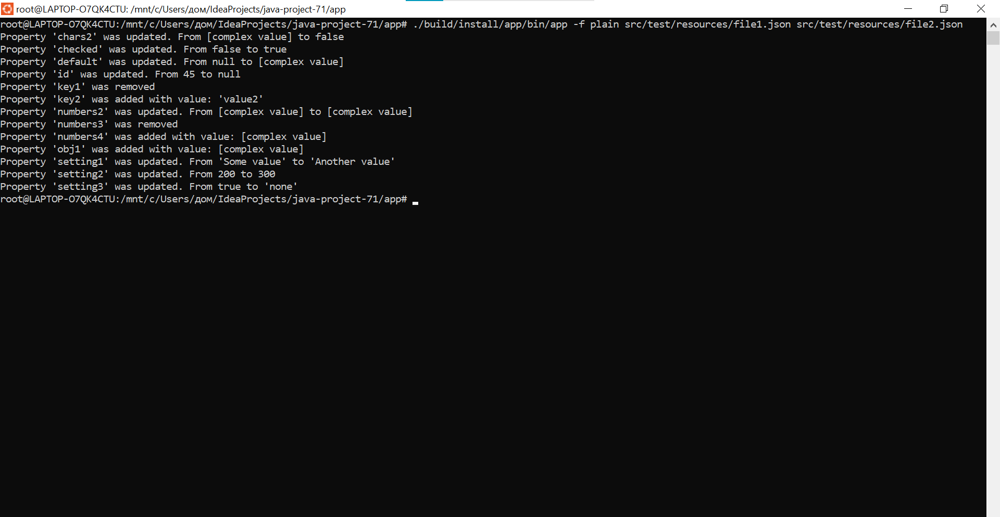

# Java-project-71:
This project a CLI utility that compares two configuration files (JSON/YAML) and displays the differences in stylish, plain, or JSON formats.

### Hexlet tests and linter status:

[Example of how the package works](https://asciinema.org/a/8h0OCq2ZvrvMaK15vcrPBueuZ)

_Example of how the package works_

_Example of how the package works_

_Example of how the package works_